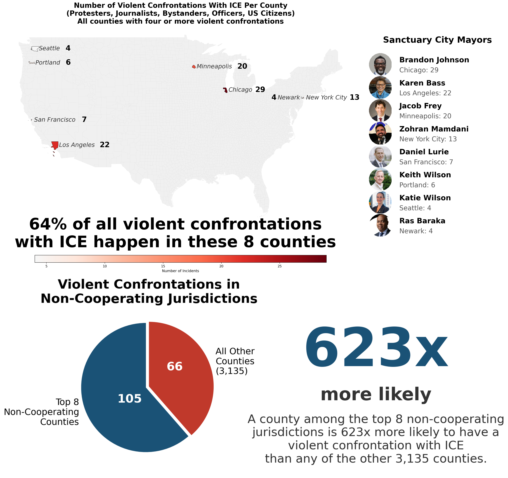
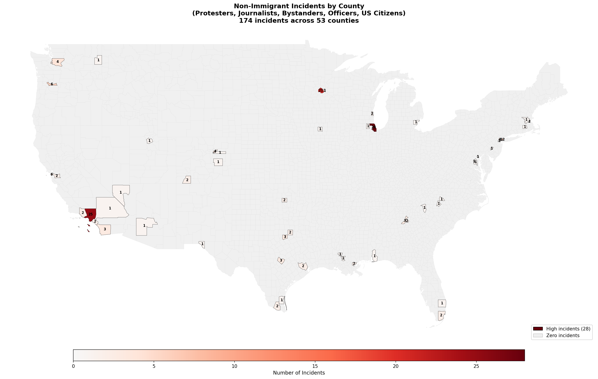
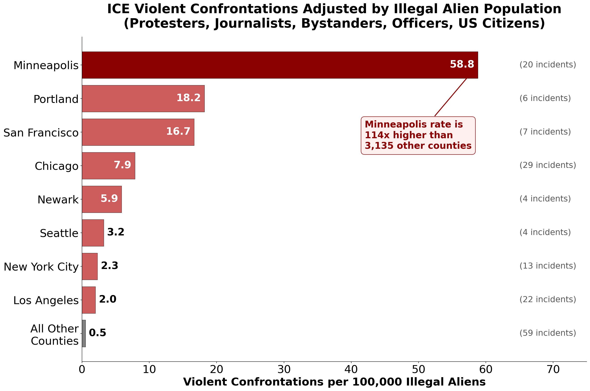

# ICE Enforcement Incidents Analysis (2025-2026)

An analysis of violent confrontations between ICE/CBP agents and non-immigrants (protesters, journalists, bystanders, officers, and US citizens) during immigration enforcement operations.

## Key Finding: Extreme Geographic Concentration

**The top 8 counties account for 64% of all violent confrontations with non-immigrants nationwide.**



### By the Numbers

| Metric | Value |
|--------|-------|
| Total non-immigrant incidents | 171 |
| Incidents in top 8 counties | 105 (64%) |
| Incidents in remaining 3,135 counties | 66 (36%) |
| Counties with 4+ incidents | 8 |
| **Per-county likelihood ratio** | **623x** |

A violent confrontation with a non-immigrant is **623 times more likely** in the top 8 counties than in any of the other 3,135 US counties.

### Top 8 Counties (4+ incidents each)

| Rank | County | City | Incidents | Mayor |
|------|--------|------|-----------|-------|
| 1 | Cook County, IL | Chicago | 29 | Brandon Johnson |
| 2 | Los Angeles County, CA | Los Angeles | 22 | Karen Bass |
| 3 | Hennepin County, MN | Minneapolis | 20 | Jacob Frey |
| 4 | New York County, NY | New York City | 13 | Zohran Mamdani |
| 5 | San Francisco County, CA | San Francisco | 7 | Daniel Lurie |
| 6 | Multnomah County, OR | Portland | 6 | Keith Wilson |
| 7 | King County, WA | Seattle | 4 | Katie Wilson |
| 8 | Essex County, NJ | Newark | 4 | Ras Baraka |

**All 8 counties are in jurisdictions with sanctuary policies that limit cooperation with federal immigration enforcement.**

### Full Distribution Map

For transparency, here is the complete map showing all 171 incidents across 53 counties:



---

## Figure 3: Population-Adjusted Analysis

Raw incident counts can be misleading because they don't account for differences in the underlying population at risk. This figure adjusts for the **illegal alien population** in each county to show the rate of violent confrontations per 100,000 illegal aliens.



### Data Sources

| Data | Source | Year | Notes |
|------|--------|------|-------|
| Incident counts | This repository (Tiers 1-4) | 2025-2026 | Non-immigrant violent confrontations |
| Illegal alien population | [Migration Policy Institute](https://www.migrationpolicy.org/programs/us-immigration-policy-program-data-hub/unauthorized-immigrant-population-profiles) | Mid-2023 | County-level estimates for 287 counties |

The MPI data uses a methodology that imputes unauthorized status from U.S. Census Bureau data (pooled 2019-2023 American Community Survey), weighted to 2023 population estimates from Penn State demographer Jennifer Van Hook.

### Key Finding: Minneapolis is a Massive Outlier

**Minneapolis has a violent confrontation rate 87x higher than the combined rate of 3,135 other US counties.**

| City | County | Incidents | Illegal Alien Pop (2023) | Rate per 100k |
|------|--------|-----------|--------------------------|---------------|
| Minneapolis | Hennepin County, MN | 20 | 34,000 | **58.8** |
| Portland | Multnomah County, OR | 6 | 33,000 | 18.2 |
| San Francisco | San Francisco County, CA | 7 | 42,000 | 16.7 |
| Chicago | Cook County, IL | 29 | 369,000 | 7.6 |
| Newark | Essex County, NJ | 4 | 68,000 | 5.9 |
| Seattle | King County, WA | 4 | 124,000 | 3.2 |
| New York City | 5 boroughs combined | 13 | 571,000 | 2.3 |
| Los Angeles | Los Angeles County, CA | 22 | 1,101,000 | 2.2 |
| **All other counties** | 3,135 counties | 59 | 11,346,000 | **0.67** |

### What This Reveals

1. **Los Angeles drops from #2 to #8** when adjusted for population - its 1.1 million illegal aliens absorbs the raw incident count
2. **Minneapolis jumps to #1** despite having fewer raw incidents than Chicago or LA - its small illegal alien population (34,000) means each incident has outsized impact
3. **NYC has the lowest rate** among top counties - 571,000 illegal aliens but only 13 incidents
4. **The 87x multiplier** means Minneapolis has over 80 times the confrontation rate of the average US county

### Methodology Note

The illegal alien population estimates are from **mid-2023**, while incident data covers **2025-2026**. Population shifts (including from enforcement actions like Minneapolis's "Operation Metro Surge") may have occurred between these periods. The MPI data covers 287 counties; for "All Other Counties," we use the national total (13.74 million) minus the sum of the 8 displayed counties.

### Generate This Figure

```bash
python scripts/generate_population_adjusted_chart.py
```

---

## Data Files

All data is available in JSON format for full reproducibility:

| File | Description | Records |
|------|-------------|---------|
| [`data/incidents/tier1_deaths_in_custody.json`](data/incidents/tier1_deaths_in_custody.json) | Deaths in ICE/CBP custody | 49 |
| [`data/incidents/tier2_shootings.json`](data/incidents/tier2_shootings.json) | Agent-involved shootings | 19 |
| [`data/incidents/tier2_less_lethal.json`](data/incidents/tier2_less_lethal.json) | Less-lethal force, wrongful detentions | 50 |
| [`data/incidents/tier3_incidents.json`](data/incidents/tier3_incidents.json) | Systematic news collection | 218 |
| [`data/incidents/tier4_incidents.json`](data/incidents/tier4_incidents.json) | Ad-hoc verified reports | 64 |
| [`data/methodology.json`](data/methodology.json) | Full methodology documentation | - |
| [`data/reference/sanctuary_jurisdictions.json`](data/reference/sanctuary_jurisdictions.json) | Jurisdiction classifications | - |

**Total: 400 documented incidents** (171 involving non-immigrants)

---

## Methodology: How Data Was Collected

### Tier 1: Official Government Data (HIGH confidence)

**Collection method:** Direct extraction from government-mandated reporting

**Sources searched:**
- [ICE Detainee Death Reporting](https://www.ice.gov/detain/detainee-death-reporting) - Official ICE death disclosures (note: ICE stopped publishing after October 2025)
- [AILA Deaths at Adult Detention Centers](https://www.aila.org/library/deaths-at-adult-detention-centers) - American Immigration Lawyers Association compilation
- DOJ court records and federal litigation filings
- FOIA releases

**What's included:** Deaths in custody, with official cause of death, facility location, and detainee demographics when available.

---

### Tier 2: Investigative Journalism & FOIA (MEDIUM-HIGH confidence)

**Collection method:** Extraction from systematic investigative reports by major news organizations

**Sources searched:**

| Source | Focus | URL |
|--------|-------|-----|
| The Trace | ICE/CBP shootings tracker | [thetrace.org/2025/12/immigration-ice-shootings-guns-tracker](https://www.thetrace.org/2025/12/immigration-ice-shootings-guns-tracker/) |
| ProPublica | US citizens detained/deported | [propublica.org/article/immigration-dhs-american-citizens-arrested-detained-against-will](https://www.propublica.org/article/immigration-dhs-american-citizens-arrested-detained-against-will) |
| ProPublica | Less-lethal weapons use | [propublica.org/article/ice-border-patrol-less-lethal-weapons](https://www.propublica.org/article/ice-border-patrol-less-lethal-weapons) |
| ProPublica | Banned chokeholds documentation | [propublica.org/article/videos-ice-dhs-immigration-agents-using-chokeholds-citizens](https://www.propublica.org/article/videos-ice-dhs-immigration-agents-using-chokeholds-citizens) |
| NBC News | ICE shootings list | [nbcnews.com/news/us-news/ice-shootings-list-border-patrol-trump-immigration-operations-rcna254202](https://www.nbcnews.com/news/us-news/ice-shootings-list-border-patrol-trump-immigration-operations-rcna254202) |
| Chicago Sun-Times | Less-lethal weapons explainer | [chicago.suntimes.com/graphics/immigration/2025/ice-less-lethal-weapons-explainer-tear-gas](https://chicago.suntimes.com/graphics/immigration/2025/ice-less-lethal-weapons-explainer-tear-gas/) |
| ACLU | Litigation filings | State-specific ACLU chapters |

**What's included:** Shootings (by and at agents), less-lethal force incidents, wrongful detentions of US citizens, excessive force complaints with video/medical documentation.

---

### Tier 3: Systematic News Search (MEDIUM confidence)

**Collection method:** Structured searches across defined news sources with consistent search terms

**Search methodology:**
1. Defined source list: AP, Reuters, NBC, CBS, ABC, CNN, major regional papers
2. Search terms: `"ICE" + "shooting"`, `"ICE" + "protest"`, `"CBP" + "force"`, `"immigration" + "arrest" + [state]`
3. Date range: January 20, 2025 - January 26, 2026
4. Each incident verified against at least one additional source

**Bias note:** May have geographic/topic selection bias toward high-profile incidents and sanctuary jurisdictions that receive more media coverage.

---

### Tier 4: Ad-Hoc Reports (LOW confidence)

**Collection method:** Targeted searches, social media verification, local news tips

**Sources:** Local newspapers, verified social media posts, community organization reports

**What's included:** Incidents with at least one credible news source and verifiable details (date, location, outcome). Each record includes `source_url` for verification.

**Bias note:** High selection bias risk. NOT used in statistical ratio calculations.

---

### Sanctuary Status Classification

**Primary source:** [DOJ Sanctuary Jurisdiction List](https://www.justice.gov/ag/us-sanctuary-jurisdiction-list) (Executive Order 14287 designations)

**Secondary source:** [ILRC State Map on Immigration Enforcement](https://www.ilrc.org/state-map-immigration-enforcement-2024)

**Classification categories:**
- `sanctuary` - State/local policy limits cooperation with ICE
- `anti_sanctuary` - State law requires cooperation with ICE
- `neutral` - No formal policy either direction
- `cooperative` - Voluntarily cooperates with ICE detainers

---

## What Counts as a "Non-Immigrant Incident"

This analysis focuses on confrontations involving people who are **not the targets of immigration enforcement**:

- **Protesters** - Individuals at demonstrations against ICE operations
- **Journalists** - Press covering enforcement actions
- **Bystanders** - Uninvolved individuals caught in enforcement operations
- **US Citizens** - American citizens wrongfully detained, assaulted, or deported
- **Officers** - ICE/CBP agents injured in attacks on facilities

These are tracked separately from incidents involving detainees or enforcement targets.

### Filtering Logic

```python
non_immigrant_categories = ['us_citizen', 'bystander', 'officer', 'protester', 'journalist']

is_non_immigrant = (
    victim_category in non_immigrant_categories or
    us_citizen == True or
    protest_related == True or
    'citizen' in victim_category
)
```

---

## Incident Schema

Each incident record includes:

```json
{
  "id": "T2-WD-001",
  "date": "2025-07-10",
  "state": "California",
  "city": "Camarillo area",
  "victim_name": "George Retes",
  "us_citizen": true,
  "victim_category": "us_citizen_collateral",
  "incident_type": "wrongful_detention",
  "circumstances": "Disabled combat veteran arrested during marijuana farm raid; released without charges",
  "source_tier": 2,
  "source_url": "https://www.propublica.org/article/immigration-dhs-american-citizens-arrested-detained-against-will",
  "source_name": "ProPublica",
  "verified": true,
  "affected_count": 1,
  "outcome_category": "injury",
  "state_sanctuary_status": "sanctuary",
  "local_sanctuary_status": "sanctuary_strong"
}
```

### Victim Categories

| Category | Description |
|----------|-------------|
| `protester` | Person at protest/demonstration |
| `journalist` | Press covering events |
| `bystander` | Uninvolved person |
| `us_citizen_collateral` | US citizen wrongly targeted |
| `officer` | Agent injured in attack |
| `detainee` | Person in custody |
| `enforcement_target` | Person being arrested |

### Incident Types

| Type | Description |
|------|-------------|
| `shooting_by_agent` | Agent discharged firearm |
| `shooting_at_agent` | Civilian shot at agents |
| `less_lethal` | Pepper spray, rubber bullets, tear gas |
| `physical_force` | Tackles, restraints, chokeholds |
| `wrongful_detention` | US citizen detained |
| `wrongful_deportation` | US citizen deported |

---

## Reproducing the Analysis

### Requirements

```bash
pip install pandas geopandas matplotlib
```

### Generate Maps

```bash
# Full map (all incidents)
python scripts/generate_county_map.py

# Filtered map (4+ incidents only)
python scripts/generate_county_map_filtered.py

# Combined visualization with pie chart
python scripts/generate_pie_charts.py
```

### Calculate the 623x Ratio

```python
import json
from collections import Counter

# Load all incident files
files = [
    'data/incidents/tier1_deaths_in_custody.json',
    'data/incidents/tier2_shootings.json',
    'data/incidents/tier2_less_lethal.json',
    'data/incidents/tier3_incidents.json',
    'data/incidents/tier4_incidents.json'
]

non_immigrant_categories = ['us_citizen', 'bystander', 'officer', 'protester', 'journalist']
county_counts = Counter()

for filepath in files:
    with open(filepath) as f:
        for inc in json.load(f):
            cat = inc.get('victim_category', '').lower()
            if (cat in non_immigrant_categories or
                inc.get('us_citizen') or
                inc.get('protest_related')):
                # Map to county (simplified - see scripts/generate_county_map.py for full mapping)
                county = get_county(inc['city'], inc['state'])
                county_counts[county] += 1

# Top 8 counties (4+ incidents)
top8 = [c for c, n in county_counts.most_common() if n >= 4]
top8_total = sum(county_counts[c] for c in top8)
remaining = sum(county_counts.values()) - top8_total

# Calculate ratio
TOTAL_US_COUNTIES = 3143
top8_rate = top8_total / len(top8)  # 105/8 = 13.125
other_rate = remaining / (TOTAL_US_COUNTIES - len(top8))  # 66/3135 = 0.0211
ratio = top8_rate / other_rate  # 623x

print(f"Ratio: {ratio:.0f}x more likely in top 8 counties")
```

---

## Known Limitations

1. **Media coverage bias** - Sanctuary jurisdictions may receive disproportionate media attention, inflating incident counts in those areas
2. **ICE reporting gaps** - ICE stopped publishing death reports after October 2025
3. **Selection bias** - Tier 3-4 data has higher selection bias risk; all tiers are included in ratio calculations
4. **Known undercounts:**
   - ProPublica found 170+ US citizen detentions; ~50 fully documented here
   - The Trace identified 26 shootings; 19 with full details here
   - GAO found ICE couldn't provide 5 years of use-of-force data

See [`data/methodology.json`](data/methodology.json) for complete methodology documentation.

---

## Repository Structure

```
ice_arrests/
├── data/
│   ├── incidents/           # Core incident data (Tiers 1-4)
│   │   ├── tier1_deaths_in_custody.json
│   │   ├── tier2_shootings.json
│   │   ├── tier2_less_lethal.json
│   │   ├── tier3_incidents.json
│   │   └── tier4_incidents.json
│   ├── reference/           # Reference data
│   │   └── sanctuary_jurisdictions.json
│   ├── sources/             # Archived source articles
│   ├── methodology.json
│   └── state_classifications.json
├── scripts/                 # Generation and verification scripts
│   ├── generate_county_map.py
│   ├── generate_county_map_filtered.py
│   ├── generate_pie_charts.py
│   ├── generate_population_adjusted_chart.py
│   ├── generate_combined_figure.py
│   └── robust_verify.py     # Source verification
├── analysis/                # Auxiliary analysis scripts and reports
├── outputs/                 # Generated figures and data exports
│   ├── figures/
│   └── data/
├── assets/                  # Images (headshots, etc.)
├── archive/                 # Deprecated files
├── non_immigrant_combined.png
├── non_immigrant_incident_map_county.png
├── ice_confrontations_adjusted_by_population.png
└── README.md
```

---

## Data Coverage

- **Time period**: January 20, 2025 - January 26, 2026
- **Geographic scope**: All 50 US states + DC
- **Last updated**: January 26, 2026

---

## License

Data compiled from public sources. Each incident record includes `source_url` for original reporting attribution.
